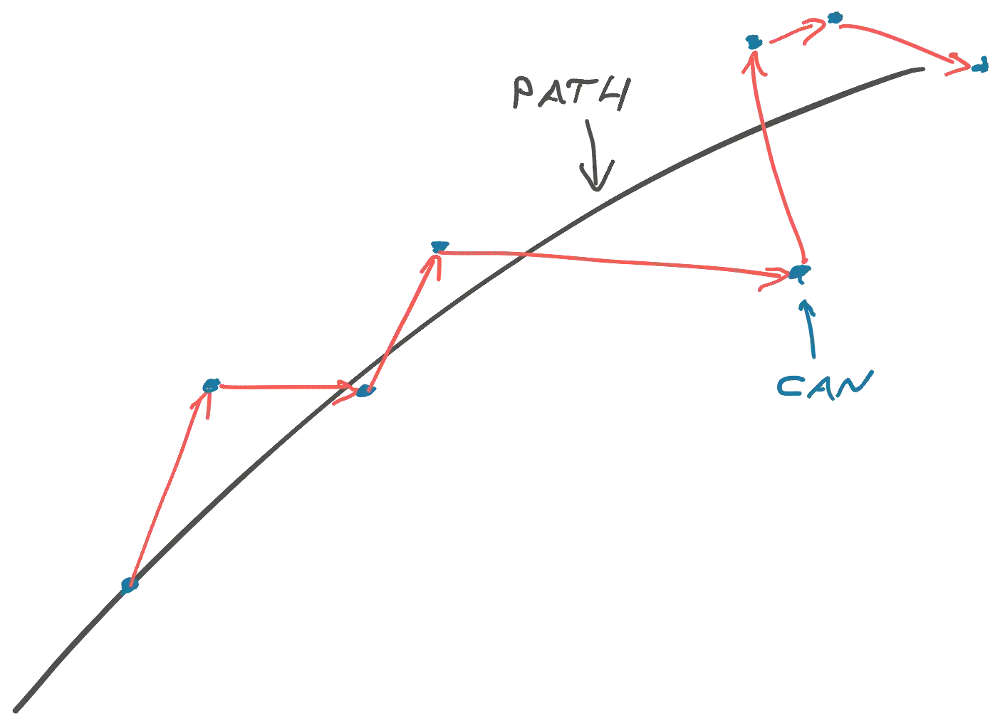

# Engineering Culture momentum

This document will contain all my thoughts, ideas, struggles, examples of Engineering Culture (EC) and the way we can define it in the company.

## What is EC?

In a growing company, it is crucial to have standards, a code of conduct, governance, best practices, and so on.
All the above can form the kernel of EC at the company, pre-define it, and seed it in the engineers' mindset.

EC is the set of common beliefs and values that will later impact the way people make decisions or actions around software development. So in this case we can turn all the standards, best practices, tooling, etc. into an EC when they are adopted and become common for every single person.

## Why is it important to define EC?

Most engineers who are happy at their job happen to work at a company with a great EC. Likewise, unhappy engineers happen to be part of a company with a not-so-great engineering culture. Company with good EC empowers and enables everyone sides to grow and develop, both engineers and company.

it is extremely hard and crucial for fast growing companies to retain EC and make it thrive. New people join company with their vision and impact. It is always good, but without some level of accountability, control, and governance from leadership this can create chaos. Hence, the goal is to define EC with enough room of freedom on one hand and clear boundaries.

## What should we address

* EC should be aligned with the company’s values
* EC is not carved in the stone for all engineers and teams. Each tenant adopts what suits better for them
* Well-balanced EC provides freedom of choice and limits following the path company takes

Giving enough freedom to engineers will bring the same results as if they kick the can while following the company's path. Harder they kick the more unpredictable can's trajectory will be, so they won't follow the path properly.

Credits to the idea and image go to [Swizec](https://swizec.com/blog/writing-software-is-like-kicking-a-can/)

## EC components

This is not the full list just something I took from the top of my head.

- agility
- automation
- autonomy
- coaching
- code reviews
- collaboration
- common goals
- continuous delivery
- egoless development
- encouraging
- impact
- innovations
- iterations
- learning
- mentoring
- pairing
- psychological safety
- shared ownership
- teamwork
- transparency
- welcoming atmosphere
- XP

## Identifying existing culture

This entire section is taken from "Accelerate", [Chapter 3](https://www.oreilly.com/library/view/accelerate/9781457191435/14-ch3.xhtml) by Nicole Forsgren, Jez Humble, Gene Kim.

Within organizational culture there are several ways to define and model "culture". Organizational culture can exist at three levels in organizations: basic assumptions, values, and artifacts.

At the first level, basic assumptions are formed over time as members of a group or organization make sense of relationships, events, and activities. These interpretations are the least "visible" of the levels—and are the things that we just know, and may find difficult to articulate, after we have been long enough in a team.

- This is something we should try to identify and highlight first. Having those, we can draw a baseline and use it in our future steps.
- Analyzing output we can group components, cluster them

The second level of organizational culture are values. Values provide a lens through which group members view and interpret the relationships, events, and activities around them. Values also influence group interactions and activities by establishing social norms, which shape the actions of group members and provide contextual rules. These are quite often the "culture" we think of when we talk about the culture of a team and an organization.

- Do we have values? What are those, put them together and see how they correlate to the previous topic

The third level of organizational culture is the most visible and can be observed in artifacts. These artifacts can include written mission statements or creeds, technology, formal procedures, or even heroes and rituals.

- It is one of the things we are going to do - document engineering culture

## Ideas and insights

- Participate in company's internal podcast about the process we are coming through
- Presenting results in the RnD monthly
- Blog post about the EC in the company (once we are done)

## Resources to learn more about EC

- [InfoQ Eng Culture podcast](https://www.infoq.com/engineering-culture-podcast/)
- [Intercom blog](https://www.intercom.com/blog/our-engineering-culture/)

## Defininitions by the other companies

- [The Guardian](https://github.com/guardian/our-engineering-culture) - perfect match, has the same approach as I was thinking about it: Github repo, developer-first oriented. The structure and content is individual and subject to discuss.
- [ING](https://www.ing.jobs/global/careers/expertise/tech/our-engineering-culture.htm) - to inspire how to create short and descriptive EC page. Looks like one of the pages company shares with candidate during hiring process.
- [Fonoa](https://www.fonoa.com/life-at-fonoa/building-a-world-class-engineering-culture-at-fonoa) - same as above. Doc is not strucutred, still nice to look at.
- [Lyst](https://making.lyst.com/2021/10/21/engineering-principles/) - well structured doc, not long nor short 🤷.
